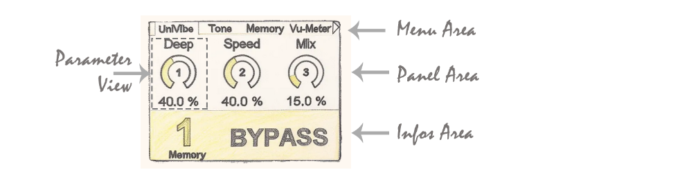

# DadGUI::cInfoView

**Namespace:** DadGUI::cInfoView  
**Files:** cInfoView.h / cInfoView.cpp  
**Directory:** DAD_FORGE/GUI/Components/  
**Description:** Provides a status area displaying the selected preset number, its modification status (dirty), and the system state (ON/OFF/BYPASS). Updates automatically.

---

## 📋 Class Description
The `cInfoView` class is a user interface (UI) component that monitors and visually displays system status in the Info Area.  
  
It manages the dynamic display of the selected preset number, the operating state (ON, OFF or BYPASS), and a visual modification indicator ("Dirty").   
The component can handle bitmap backgrounds loaded from flash memory and dynamically adapts to the system's active color palette.

---

## 🔗 External Dependencies

### File Inclusions

| Included File | Source | Role |
|:---|:---|:---|
| `"cDisplay.h"` | `DAD_FORGE/GUI/Components` | Display manager. |
| `"cFlasherStorage.h"` | `DAD_FORGE/Drivers` | Flash storage access for loading background images. |

### External Functions Called

|Signature | Source | Usage |
|:---|:---|:---|
| `bool sendEventToActive_SerializeIsDirty()` | `__GUI_EventManager` | Checks if parameters have been modified (Dirty status). |

### Global Variables Used and Driver Objects

| Variable / Object | Type | Source | Role |
|:---|:---|:---|:---|
| `__Display` | `cDisplay*` | `extern` | Main display and layer manager. |
| `__FlasherStorage` | `cFlasherStorage` | `extern` | Access to graphic resources stored in Flash. |
| `__MemoryManager` | `cMemoryManager` | `extern` | Retrieves the active memory slot. |
| `__GUI_EventManager` | `cGUI_EventManager` | `extern` | Notification of state changes (Dirty flag). |
| `__MemOnOff` | `eOnOff` | `extern` | Current memory state (ON/OFF/BYPASS). |
| `__pActivePalette` | `cPalette*` | `extern` | Retrieves user interface colors. |

---

## 🎯 Associated Enumerations and Structures
No local enumerations or associated structures.

---

## 📚 Public Methods

### **Init**

| Element | Details |
|:---|:---|
| **Method** | `void Init()` |
| **Description** | Initializes internal members, creates the dedicated display layer, and loads background images from flash memory. |
| **Return** | `void` |

### **Activate**

| Element | Details |
|:---|:---|
| **Method** | `void Activate() override` |
| **Description** | Activates the component, brings it to the foreground (Z-order), and initializes the display with the current memory state. |
| **Return** | `void` |

### **Deactivate**

| Element | Details |
|:---|:---|
| **Method** | `void Deactivate() override` |
| **Description** | Deactivates the component and sends the display layer to the background. |
| **Return** | `void` |

### **Update**

| Element | Details |
|:---|:---|
| **Method** | `void Update() override` |
| **Description** | Checks if the system state (slot, ON/OFF state, or Dirty status) has changed to refresh the display. |
| **Return** | `void` |

### **Redraw**

| Element | Details |
|:---|:---|
| **Method** | `void Redraw() override` |
| **Description** | Forces a complete redraw of the component with the current system state. |
| **Return** | `void` |

### **ShowView**

| Element | Details |
|:---|:---|
| **Method** | `void ShowView(bool isDirty, uint8_t MemSlot, const std::string State)` |
| **Description** | Draws the complete interface: background, "Memory" label, slot number, "Dirty" indicator, and state text. |
| **Parameter(s)** | |
| `isDirty` | `bool` Indicates whether the modification indicator should be displayed. |
| `MemSlot` | `uint8_t` Memory slot number to display. |
| `State` | `const std::string` Textual representation of the state (e.g., "ON"). |
| **Return** | `void` |

---

## 📦 Data Members (Variables)

### Protected / Private Variables

| Member | Type | Description |
|:---|:---|:---|
| `m_isActive` | `bool` | Component activation state. |
| `m_pInfoLayer` | `DadGFX::cLayer*` | Pointer to the dedicated display layer. |
| `m_pImageInfoLayer` | `DadGFX::cImageLayer* [MAX_IMAGE_LAYER]` | Array of pointers to background image layers. |
| `m_NumImageInfoLayer` | `int8_t` | Index of the currently displayed image layer. |
| `m_MemState` | `eOnOff` | Stores the displayed system state. |
| `m_MemSlot` | `uint8_t` | Stores the displayed preset number (memory slot). |
| `m_MemDirty` | `bool` | Stores the displayed modification status (dirty). |

---
**DAD_FORGE/DSP** - Dad Design DSP Library  
Copyright (c) 2024-2026 Dad Design.