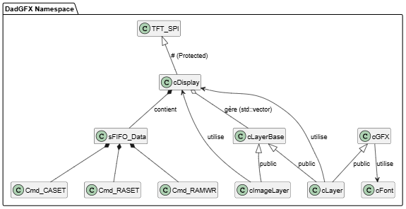
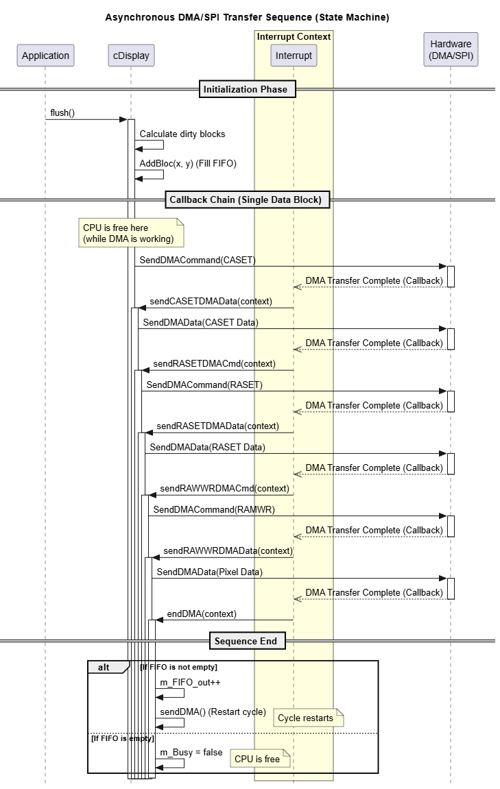

# Description
STM_GFX2 is a **lightweight graphics engine** designed for STM32 microcontrollers. It is specifically optimized for driving displays connected via an SPI bus in real-time environments where CPU resources are limited.

To **minimize CPU load and SPI bus bandwidth**, the engine uses a **framebuffer** divided into blocks. Only modified blocks are transmitted to the display. Updates are entirely hardware-managed: blocks to be refreshed are placed in a queue and then automatically transferred to the display by the STM32's **DMA** controller.

STM_GFX2 also supports a **graphical layers** system with Z-order management and transparency via an Alpha channel. Layer composition and blending into the framebuffer are hardware-accelerated by the **DMA2D** controller available on compatible STM32 devices.

The engine provides a comprehensive set of **graphics primitives** such as lines, rectangles, circles, bitmap images, and text rendering using bitmap fonts. It also supports screen rotation.

# Class Diagram

The **DadGFX** graphics engine is built on a modular architecture organized around three main concepts: **layers**, the **display manager**, and **graphical abstraction**. This organization clearly separates responsibilities between graphics rendering, layer composition, and low-level display driving.

## Layers

Layers are the fundamental building blocks of graphical rendering.

**cLayerBase** is the abstract base class common to all layers. It defines the general interface that allows a layer to participate in the display process.

**cLayer** inherits from both **cLayerBase** and **cGFX**. This dual inheritance allows it to benefit from all graphics primitives (drawing lines, rectangles, text, circles, etc.) and to apply them to its own memory buffer (*frame buffer*). An instance of **cLayer** thus represents a complete graphical layer on which drawing operations can be performed.

**cImageLayer** also inherits from **cLayerBase** but specializes in displaying images and bitmaps stored in memory. It makes it easy to integrate precomputed graphical resources into the final screen composition.

## Display Manager

The hardware layer is provided by **TFT_SPI**, which directly drives the TFT display via the SPI interface.

Above this hardware layer sits **cDisplay**, which inherits from **TFT_SPI** and is the core of the graphics engine. This class acts as a central manager responsible for:

- maintaining the list of active layers;
- performing composition (*blending*) of the different layers into the output framebuffer;
- detecting modified areas;
- transmitting only the modified blocks to the display to optimize SPI bus and CPU usage.

To ensure this efficient transmission, **cDisplay** relies on:

- a `std::vector` container holding pointers to the various **cLayerBase** instances;
- a **sFIFO_Data** queue for ordering commands and DMA transfers.

### **FIFO operation**
To draw a rectangle on an LCD display, the SPI protocol requires the following sequence of operations:

1) CASET command (Set Column Address)  
2) CASET data (X coordinates)  
3) RASET command (Set Row Address)  
4) RASET data (Y coordinates)  
5) RAMWR command (Write to RAM)  
6) RAMWR data (pixel data)  

To perform these transfers as efficiently as possible, without idle time and without unnecessarily occupying the CPU, the graphics engine uses an Asynchronous State Machine driven by interrupts.

The static functions shown below are chained together automatically. Each function starts an SPI transfer using DMA. When the transfer is completed, an interrupt invokes the next function, which in turn starts the next step of the sequence.

Once all transfers required for a block (rectangle) have been completed, the state machine checks whether additional blocks are waiting in the transmission FIFO. If so, a new transfer cycle is immediately started and continues until the FIFO becomes empty.

## Graphical Abstraction

**cGFX** is an abstract class that defines all the drawing primitives of the graphics engine. It provides a common interface for graphical operations such as:

- line drawing;
- rectangle drawing;
- circle rendering;
- text display;
- fill operations.

Low-level functions like `setPixel()` or `setRectangle()` are not directly implemented in **cGFX**. Their implementation is delegated to derived classes, notably **cLayer**, which provide concrete access to the pixel buffer.

This approach allows the drawing algorithms to be decoupled from the memory representation used by the different layers.

## Font Management

The **cFont** class handles the font management used by the graphics engine. It encapsulates descriptive font information through various data structures such as **GFXfont**, **GFXglyph**, and their associated descriptors.

This abstraction allows the text engine to manipulate different font types while maintaining a uniform interface for character rendering.

---

**DAD_FORGE/DSP** - Dad Design DSP Library  
Copyright (c) 2024-2026 Dad Design.