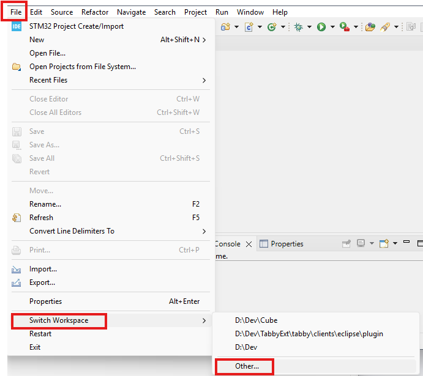
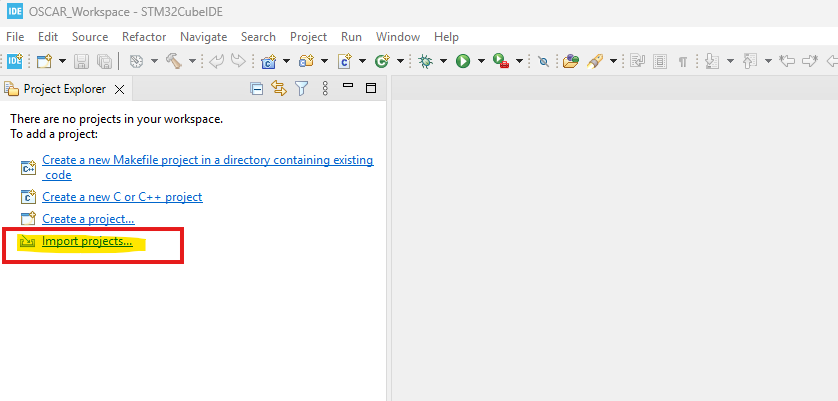
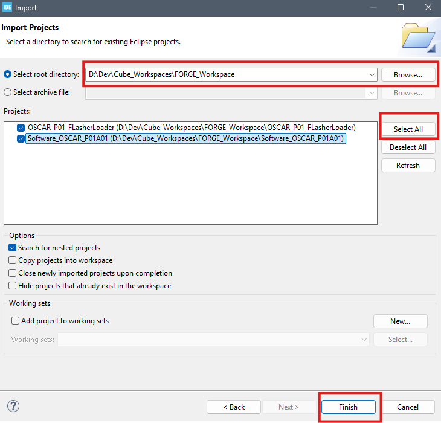
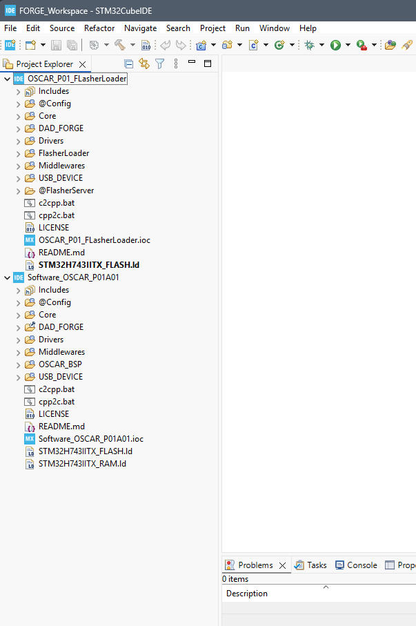

# How to Create Your Workspace

{: .text-blue-300 }
This tutorial explains how to clone and set up the necessary repositories for developing audio effects within the OSCAR Workshop environment.

> {: .note }
> **Note**  
> Once you are familiar with the OSCAR Workshop environment and its development tools, you can certainly organize your workspace and repositories differently. The method described here is simply a recommended starting point.

## Prerequisites

Before starting, ensure that the following tools are installed on your computer:

* Git
* STMicroelectronics STM32CubeIDE

***

## Creating the Workspace Directory

Create a working directory for STM32CubeIDE projects, for example, named **`FORGE_Workspace`**.

Run the following commands:

```bash
mkdir FORGE_Workspace
cd FORGE_Workspace
```

***

## Clone the Project

We will retrieve the repository containing the source files and configurations required by STM32CubeIDE to build the executable for your effect.

For the OSCAR hardware target, use the following command:
```bash
git clone --recurse-submodules https://github.com/DADDesign-Projects/Software_OSCAR_P01A01
```

For the PENDA hardware target, use the following command:
```bash
git clone --recurse-submodules https://github.com/DADDesign-Projects/PENDA-Software
```
The repository is now available in your workspace:

OSCAR:
```
FORGE_Workspace
   |___PENDA-Software
```
PENDA:
```
FORGE_Workspace
   |___PENDA-Software
```

## Cloning Flasher Loader

Next, clone the flasher/bootloader project:

OSCAR:
```bash
git clone --recurse-submodules https://github.com/DADDesign-Projects/OSCAR_P01_FLasherLoader
```

PENDA:
```bash
git clone --recurse-submodules https://github.com/DADDesign-Projects/PENDA_FLasherLoader
```

This project includes:
* The flasher utility, used to transfer resource files (images, fonts, ELF executables, samples, etc.) into the external QSPI flash memory of the OSCAR or PENDA board.
* The bootloader, which is used by the pedal to launch the selected executable from the external QSPI flash memory upon power-up.

***

## Opening the Workspace in STM32CubeIDE

1. Launch STM32CubeIDE.
   * If the IDE opens directly without prompting you to select your workspace directory,\
click **Other...** in the `File/Switch Workspace` menu.
   

   Whether opening directly or after clicking on the `File/Switch Workspace` menu, a dialog box will appear asking for your desired workspace location:
    * Click on **Browse**.
    * Select the directory you just created (`FORGE_Workspace` in this tutorial).
  


***

## Importing the Projects into the STM32CubeIDE Workspace

### 1. In the **Project Explorer**, click on **Import Projects**.



### 2. In the **Import** dialog box:
* Select **General** /**Existing Projects into Workspace**.
* Then, click the **Next** button.


### 3. In the **Import** dialog box, select the **root directory**:
* Click on **Browse** 🔍.
* Select your workspace directory (`FORGE_Workspace` in this example).
* Click on **Select All** ✅.
* Finally, click the **Finish** button.




***

## ✅ Your Workspace is now configured

You are ready to start working with FORGE projects.  
👉 See the next tutorial to compile your first effect  

