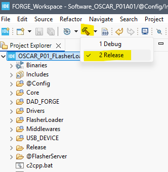
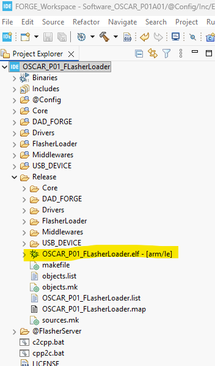

# How to Compile FlasherLoader

{: .text-blue-300 }
This tutorial explains how to compile the FlasherLoader utility.

> {: tip }
> **About FlasherLoader**
> The FlasherLoader serves two primary functions on the OSCAR P01 board:
> *   It is a flasher utility used to transfer resource files (images, fonts, ELF executables, samples, etc.) into the external QSPI flash memory.
> *   It acts as the bootloader, which allows the pedal to launch selected executables from the external QSPI flash memory upon power-up.

## Prerequisites

**You must have the following installed and configured:**

*   Git and STM32CubeIDE.
*   The [OSCAR_P01_FlasherLoader](https://github.com/DADDesign-Projects/OSCAR_P01_FlasherLoader) repository cloned, with the workspace properly configured in STM32CubeIDE.

*See: [How to Create Your Workspace ](../1-Workspace/1-TutoWorkspace.html)*

***

## Compiling FlasherLoader

Follow these steps to compile FlasherLoader:

1.  Select the `OSCAR_P01_FlasherLoader` project within STM32CubeIDE.
2.  Build the project using the **`Release`** configuration.

The compilation process will now begin.

*   If the compilation completes successfully, a directory named `Release` should appear inside your project structure.
*   This directory contains the generated executable file: `OSCAR_P01_FlasherLoader.elf`.

***

