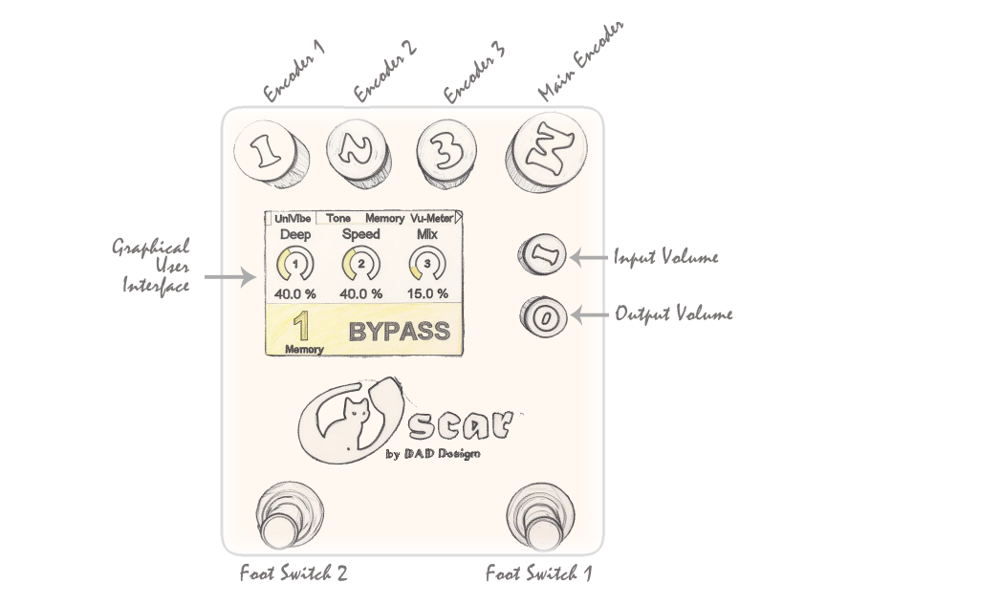

# Essential Guide to Developing Guitar Effects

{: .text-blue-300 }
>This chapter illustrates, through practical examples, the fundamental principles of implementing the FORGE library for developing guitar effects within the OSCAR ecosystem.

## Prerequisites
This chapter’s tutorial requires the following:
* An ST-Link probe (or a compatible clone) for programming and debugging.
* You must have configured your development workspace. See: [How to Create Your Workspace](../Workspace/TutoWorkspace.html)
* We strongly recommend completing the "To Begin" tutorials first.

## Key Concepts and Terminology
Before we start writing an effect, let’s first agree on some common terminology and conventions.

### **Parameters**:
A parameter is an piece of information or a value that is given to a system, function, or machine so that it can adapt or operate in a certain way. Example: the frequency of an oscillator.

### **Hardware Interface**

### **Graphical User Interface**

**Area Layout Description:**  
The upper portion of the screen features a Menu Area containing a variable number of selectable items. A main encoder facilitates cycling through these menu items; each item is associated with a panel displayed in the central Panel Area.  
The lower section consists of an Info Area, which permanently displays the pedal's status and the currently selected memory preset. This area can be temporarily overlaid by a transient Information Panel that provides detailed operational data—for example, while modifying a specific parameter.
