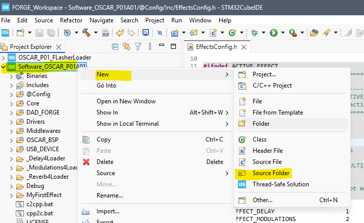
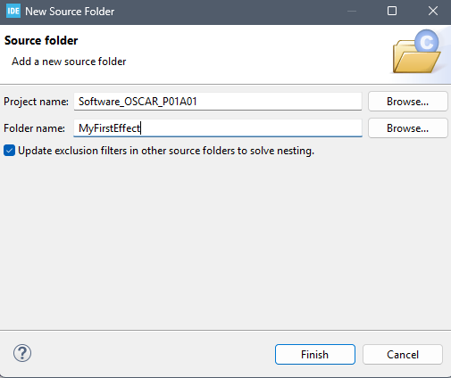

# Setting Up the Project

{: .text-blue-300 }
> First, we will set up our effect inside the project.
> * Creating the effect directories.
> * Adding our effect to the FORGE effects list.

## Creating the Effect Directories.

1. Open **STM32CubeIDE** with `OSCAR_Workspace` as your workspace.

2. Select the project `Software_OSCAR_P01A01` or `PENDA_Software`.

3. Create a directory named `MyFirstEffect` inside root :
   - Right-click on the `Software_OSCAR_P01A01` or `PENDA_Software` folder → **New / Source Folder**.
  


</BR>



1. Inside `MyFirstEffect`, create two subdirectories: `Inc` and `Src`.
   
2. Select the `Inc` directory and add it to the include path:
   - Right-click on `Inc` → **Add/Remove Include Path**, then check all build configurations.


## Create sources files
1. Create a new header file `cMyFirstEffect.h` inside `Inc`:
   - Right-click on `Inc` → **New / Header File**.


1. Create a new source file `cMyFirstEffect.cpp` inside `Src`:
   - Right-click on `Src` → **New / Source File**.


## Adding Our Effect to the FORGE Effects List

Open and edit the configuration file `...@Config\Inc\EffectsConfig.h` as follows:


```cpp
#pragma once
//****************************************************************************
// File: EffectsConfig.h
//
// 
// Copyright (c) 2025 Dad Design.
//****************************************************************************
#include "ID.h"
#include "stdint.h"

#ifndef ACTIVE_EFFECT
// ==========================================================================
// EFFECT SELECTION
// --------------------------------------------------------------------------
// Select the active effect by setting ACTIVE_EFFECT to one of the values
// defined below. Only ONE effect can be active at a time.
// ==========================================================================

#define ACTIVE_EFFECT MY_FIRST_EFFECT
//#define ACTIVE_EFFECT  EFFECT_DELAY
//#define ACTIVE_EFFECT EFFECT_REVERB
//#define ACTIVE_EFFECT EFFECT_MODULATIONS
//#define ACTIVE_EFFECT EFFECT_TEMPLATE
//#define ACTIVE_EFFECT EFFECT_TEMPLATE_MULTI_MODE


// --- Available effect identifiers (do not modify) -----------------------
#endif
#define MY_FIRST_EFFECT                 6
#define EFFECT_DELAY                    1
#define EFFECT_MODULATIONS              2
#define EFFECT_REVERB                   3
#define EFFECT_TEMPLATE                 4
#define EFFECT_TEMPLATE_MULTI_MODE      5


// ==========================================================================
// EFFECT INCLUDE DISPATCH
// --------------------------------------------------------------------------
// Includes the header corresponding to the active effect.
// ==========================================================================
#if ACTIVE_EFFECT == MY_FIRST_EFFECT
   #include "cMyFirstEffect.h"

#elif ACTIVE_EFFECT == EFFECT_DELAY
    #include "Delay.h"

#elif ACTIVE_EFFECT == EFFECT_MODULATIONS
    #include "cModulations.h"

#elif ACTIVE_EFFECT == EFFECT_REVERB
    #include "Reverb.h"

#elif ACTIVE_EFFECT == EFFECT_TEMPLATE
    #include "cTemplateEffect.h"

#elif ACTIVE_EFFECT == EFFECT_TEMPLATE_MULTI_MODE
    #include "TemplateMultiModeEffect.h"

#else
    #error "ACTIVE_EFFECT is not defined or does not match any known effect."
#endif

//***End of file**************************************************************
```
