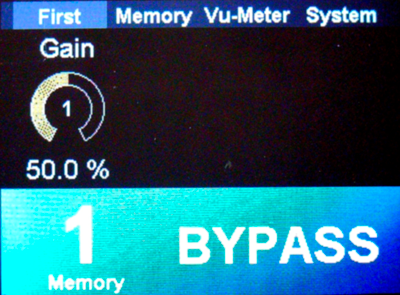
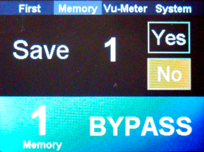
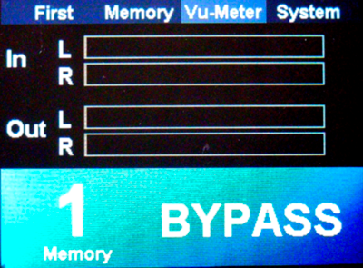
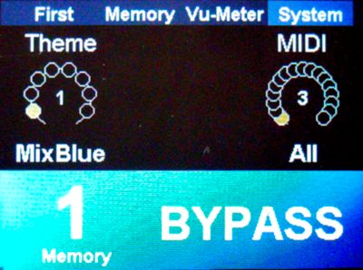

# Build and Execute

{: .text-blue-300 }
> In just a few lines, we have created our first effect! All that remains now is to compile and run it.

## Compilation
Select the debug or release build configuration and start compiling the effect. The program should compile without errors. If it doesn't, please review the tutorial and correct any omissions or typos :)

## Run/Debug

{: .warning}
> Make sure you have flashed all necessary resources to the card’s QSPI flash memory.  
> *see [How to Use FlasherLoader](../LoaderFlasher/LoaderFlasher.html)*. 

 
Then, launch the program in either debug or release mode. You now get to see your first GUI appear!
Your **"First panel"** displays the gain parameter. You can adjust it by turning Encoder 1.

### **Three other panels were automatically created for you:**
 
**Memory Panel**  
This allows you to save the value of your parameters (like the gain in our effect) into 10 different presets.  

**VU-Meter Panel**  
This panel displays the input and output signal, helping you optimally set your input level and visualize your wet (digital output) signal.  

**System Panel**  
The System panel allows you to change the display theme and configure the MIDI channel being listened to.  

