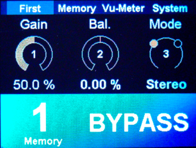

# Final code

{: .text-blue-300 }
> You can find the final code for this tutorial below.  




## MyFirstEffect.h
```cpp
#pragma once
#include "cEffectBase.h"
 
#define DECLARE_EFFECT cMyFirstEffect __Effect
#define EFFECT_NAME "MyFirstEffect"
#define EFFECT_VERSION "Version 1.0"
#define EFFECT_SPLATCH_SCREEN "Template.png"
constexpr uint32_t EFFECT_BUILD =   BUILD_ID('F', 'I', 'R', '1');


class cMyFirstEffect : public DadEffect::cEffectBase {
public:
    // -------------------------------------------------------------------------
    // Constructor - performs no initialization by itself
    // -------------------------------------------------------------------------
    cMyFirstEffect() = default;

    // -------------------------------------------------------------------------
    // Initializes DSP components and user interface parameters
    // -------------------------------------------------------------------------
    void onInitialize() override;

    // -------------------------------------------------------------------------
    // Returns the unique effect identifier
    // -------------------------------------------------------------------------
    uint32_t getEffectID() override;

    // -------------------------------------------------------------------------
    // Audio processing function - processes one input/output audio buffer
    // -------------------------------------------------------------------------
    void onProcess(AudioBuffer *pIn, AudioBuffer *pOut, DadGUI::eEffectState_t State, bool Silence) override;

    // -------------------------------------------------------------------------
    // Gain callback
    // -------------------------------------------------------------------------
    void static onGainChange(DadDSP::cParameter* pGainParameter, uint32_t Data);

    // -------------------------------------------------------------------------
    // Pan callback
    // -------------------------------------------------------------------------
    void static onPanChange(DadDSP::cParameter* pPanParameter, uint32_t Data);

    // -------------------------------------------------------------------------
    // Compute left/right channel gains using a logarithmic (power) curve
    // -------------------------------------------------------------------------
     void CalcGainLog();

protected:
    // =========================================================================
    // Protected Member Variables
    // =========================================================================

    // -------------------------------------------------------------------------
    // Parameter declarations
    // -------------------------------------------------------------------------
    DadGUI::cUIParameter                m_ParameterGain;        // Gain control parameter
    DadGUI::cUIParameter                m_ParameterPan;         // Stereo Panning parameter
    DadGUI::cUIParameter                m_ParameterStereoMode;  // Stereo mode parameter

    // -------------------------------------------------------------------------
    // Parameter view declarations
    // -------------------------------------------------------------------------
    DadGUI::cParameterNumNormalView     m_ParameterGainView;    	// GUI view for the gain parameter
    DadGUI::cParameterNumLeftRightView  m_ParameterPanView;  		// GUI view for Panning parameter
    DadGUI::cParameterDiscretView       m_ParameterStereoModeView;	// GUI view for stereo mode parameter

    // -------------------------------------------------------------------------
    // Panel declarations
    // -------------------------------------------------------------------------
    DadGUI::cPanelOfParameterView       m_ParameterFirstPanel;        // Demo panel containing

    // -------------------------------------------------------------------------
    // Variables
    // -------------------------------------------------------------------------
    float   m_RightGain;  // Right gain calculated
    float   m_LeftGain;   // Left gain calculated
};

```

## MyFirstEffect.cpp
```cpp
#include "EffectsConfig.h"

#if ACTIVE_EFFECT == MY_FIRST_EFFECT
#include "cMyFirstEffect.h"

// Unique effect identifier (32-bit)
constexpr uint32_t MY_FIRST_EFFECT_ID = BUILD_ID('M', 'F', 'E', '1');

// -----------------------------------------------------------------------------
// Method: onInitialize
// Description: Called once when the effect is loaded. Used to initialize
//              parameters, GUI elements, and internal DSP objects.
// -----------------------------------------------------------------------------
void cMyFirstEffect::onInitialize()
{
    // Initialize the Gain parameter
    m_ParameterGain.Init(MY_FIRST_EFFECT_ID,// Serialize ID
                         50.0f,             // Default value
                         0.0f,              // Minimum value
                         100.0f,            // Maximum value
                         5.0f,              // Fast increment
                         1.0f,              // Slow increment
                         onGainChange,      // Callback function
                         (uint32_t)this,    // Callback user data
                         1.0f,              // Transition time (seconds)
                         20);               // MIDI CC number

    // Initialize the Gain parameter
    m_ParameterPan.Init(MY_FIRST_EFFECT_ID, // Serialize ID
                         0.0f,              // Default value
                         -100.0f,           // Minimum value
                         100.0f,            // Maximum value
                         5.0f,              // Fast increment
                         1.0f,              // Slow increment
                         onPanChange,       // Callback function
                         (uint32_t)this,    // Callback user data
                         1.0f,              // Transition time (seconds)
                         21);               // MIDI CC number

    // Initialize the Gain parameter
    m_ParameterStereoMode.Init(MY_FIRST_EFFECT_ID,// Serialize ID
                         0.0f,              // Default value
                         0.0f,              // Minimum value
                         0.0f,              // Maximum value
                         1.0f,              // Fast increment
                         1.0f,              // Slow increment
                         nullptr,           // Callback function
                         0,                 // Callback user data
                         0.0f,              // Transition time (seconds)
                         22);               // MIDI CC number

    // Initialize the GUI view for the parameter
    m_ParameterGainView.Init(&m_ParameterGain,// Linked parameter
                             "Gain",        // Short name
                             "Gain",        // Long name
                             "%",           // Unit (short)
                             "percent");    // Unit (long)

    // Initialize the GUI view for the parameter
    m_ParameterPanView.Init(&m_ParameterPan,// Linked parameter
                             "Pan",         // Short name
                             "Pan control", // Long name
                             "%",           // Unit (short)
                             "percent");    // Unit (long)

    // Initialize the GUI view for the parameter
    m_ParameterStereoModeView.Init(&m_ParameterStereoMode, // Linked parameter
                             "Mode",        // Short name
                             "Stereo Mode");// Long name

    m_ParameterStereoModeView.AddDiscreteValue(
                            "Stereo",       // ShortDiscretValue
                            "Stereo");      // LongDiscretValue

    m_ParameterStereoModeView.AddDiscreteValue(
                            "Mono",         // ShortDiscretValue
                            "Mono");        // LongDiscretValue

    // Create a parameter panel for the user interface
    m_ParameterFirstPanel.Init(&m_ParameterGainView,      // Parameter View 1
                              &m_ParameterPanView,        // Parameter View 2
                              &m_ParameterStereoModeView);// Parameter View 3

    // Add the panel to the effect's menu
    m_Menu.addMenuItem(&m_ParameterFirstPanel, "First");
}

// -----------------------------------------------------------------------------
// Method: getEffectID
// Description: Returns the unique 32-bit identifier of the effect.
// -----------------------------------------------------------------------------
uint32_t cMyFirstEffect::getEffectID()
{
    return MY_FIRST_EFFECT_ID;
}

// -----------------------------------------------------------------------------
// Method: onProcess
// Description: Main audio processing function. Called continuously for
//              every audio buffer.
// -----------------------------------------------------------------------------
void cMyFirstEffect::onProcess(AudioBuffer *pIn, AudioBuffer *pOut, DadGUI::eEffectState_t State, bool Silence)
{
    float Left = pIn->Left;
    float Right = pIn->Right;

    // Test stereo mode
    if(m_ParameterStereoMode.getValue() == 1.0f){
    	// convert to mono
    	Left = (Left + Right) / 2.0f;
    	Right = (Right + Left) / 2.0f;
    }

    pOut->Left  = Left  * m_LeftGain;
    pOut->Right = Right * m_RightGain;
}

// -------------------------------------------------------------------------
// Compute left/right channel gains using a logarithmic (power) curve
// -------------------------------------------------------------------------
void cMyFirstEffect::CalcGainLog()
{
    // Retrieve normalized parameter values [0.0 .. 1.0]
    float Gain    = m_ParameterGain.getNormalizedValue();
    float Pan = m_ParameterPan.getNormalizedValue();

    // Constant-power panning law: apply a square-root curve (exponent 0.5)
    float gain_left  = std::pow(1.0f - Pan, 0.5f); // fades out as pan moves right
    float gain_right = std::pow(Pan,         0.5f); // fades in  as pan moves right

    // Apply the master gain on top of each channel's pan gain
    m_LeftGain  = Gain * gain_left;
    m_RightGain = Gain * gain_right;
}

// -------------------------------------------------------------------------
// Gain callback
// -------------------------------------------------------------------------
void cMyFirstEffect::onGainChange(DadDSP::cParameter* pGainParameter, uint32_t Data){

	// Cast Data to cMyFirstEffect instance pointer
	cMyFirstEffect* pThis = (cMyFirstEffect *) Data;

	pThis->CalcGainLog();
}

// -------------------------------------------------------------------------
// Pan callback
// -------------------------------------------------------------------------
void cMyFirstEffect::onPanChange(DadDSP::cParameter* pPanParameter, uint32_t Data){
	cMyFirstEffect* pThis = (cMyFirstEffect *) Data;

	pThis->CalcGainLog();
}
#endif
```

