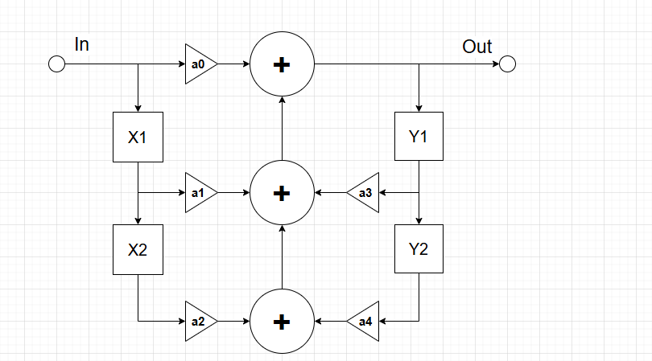
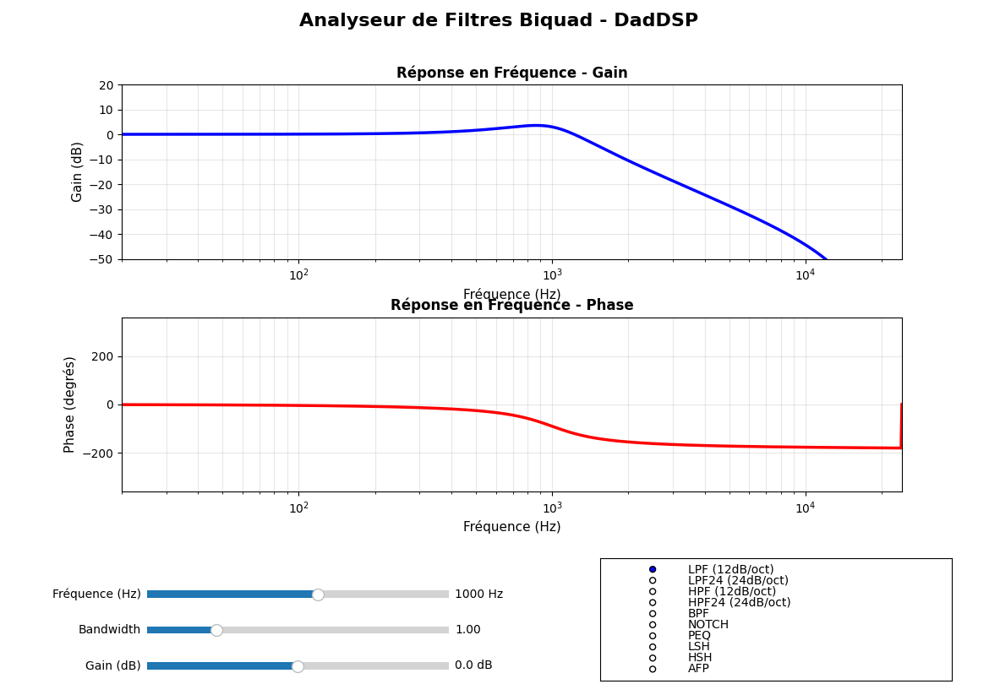

# How to Add Biquad Filters

{: .text-blue-300 }
> This chapter explains how to use filters in an audio effect.  
> In this example, we will add filters inside the feedback loop of our delay effect to simulate the sound of analog bucket brigade devices (BBD) or magnetic tape delays.

## Introduction to Biquad Filters

Biquad (or biquadratic) filters are among the most commonly used filters in digital audio processing. They are extremely flexible and can be used to create equalizers, tone controls, cutoff filters, and many other audio effects.

A biquad filter is a second-order filter structure. Internally, it uses delayed input and feedback signals combined with several coefficients to generate the filtered output signal. This architecture is computationally efficient while still allowing a wide variety of frequency responses.

The coefficients of a biquad filter are calculated from parameters such as:

* Cutoff frequency
* Gain
* Resonance (Q)

Most modern implementations are based on the famous **Robert Bristow-Johnson Biquad Cookbook**, which provides efficient formulas for generating filter coefficients.

## Main Types of Biquad Filters

* **Low-Pass (LPF)**  
  Passes low frequencies and attenuates high frequencies.

* **High-Pass (HPF)**  
  Passes high frequencies and attenuates low frequencies.

* **Band-Pass (BPF)**  
  Passes only a narrow band of frequencies around a center frequency.

* **Notch / Band-Stop (NOTCH)**  
  Removes a narrow frequency band. Useful for suppressing resonances or feedback.

* **Peak / Bell (PEQ)**  
  Boosts or attenuates a specific frequency band. Commonly used in parametric equalizers.

* **Low-Shelf (LSH)**  
  Boosts or cuts all frequencies below a given frequency.

* **High-Shelf (HSH)**  
  Boosts or cuts all frequencies above a given frequency.

* **All-Pass (APF)**  
  Keeps the same amplitude for all frequencies but changes phase response. Useful for phasing effects and phase correction.

## biquad.pyw

To help configure and visualize filters, you can use the Python utility:

```text
DAD_FORGE/@Python Utilities/BiQuad Visu/biquad.pyw
```

This tool displays the filter frequency response according to the selected parameters.




## The Code

We will now modify the previous delay effect to add filtering.

In this example, we will use:

* A low-pass filter for the treble
* A high-pass filter for the bass

Both filters will be inserted inside the feedback loop of the delay.


### **In cMyFirstEffect.h**

Import the `cBiQuad` class declaration:

```cpp
#include "BiquadFilter.h"
```

Add two new parameters and their associated GUI views:

```cpp
DadGUI::cUIParameter                m_DelayTreble;      // Treble parameter
DadGUI::cUIParameter                m_DelayBass;        // Bass parameter
...
...
DadGUI::cParameterNumNormalView     m_DelayTrebleView;  // GUI view for Treble parameter
DadGUI::cParameterNumNormalView     m_DelayBassView;    // GUI view for Bass parameter
```

Add a panel to contain the filter controls:

```cpp
DadGUI::cPanelOfParameterView       m_FilterPanel;      // Filter panel
```

Declare two callbacks used to detect parameter changes:

```cpp
// -------------------------------------------------------------------------
// Treble callback
// -------------------------------------------------------------------------
void static onTrebleChange(DadDSP::cParameter* pFreqTrebleParameter, uint32_t Data);

// -------------------------------------------------------------------------
// Bass callback
// -------------------------------------------------------------------------
void static onBassChange(DadDSP::cParameter* pFreqBassParameter, uint32_t Data);
```

Finally, declare the two biquad filters:

```cpp
// -------------------------------------------------------------------------
// Biquad filters
// -------------------------------------------------------------------------
DadDSP::cBiQuad                     m_TrebleFilter;     // Treble filter
DadDSP::cBiQuad                     m_BassFilter;       // Bass filter
```
### **In cMyFirstEffect.cpp**

Include the mathematical library:
```cpp
#include <cmath>
```

Define the minimum and maximum cutoff frequencies for both filters:
```cpp
// Filter ranges
constexpr float MAX_TREBLE_FILTER = 15000.0f;
constexpr float MIN_TREBLE_FILTER = 1500.0f;

constexpr float MAX_BASS_FILTER   = 500.0f;
constexpr float MIN_BASS_FILTER   = 50.0f;
```

**Inside onInitialize()**

Initialize the new parameters:

```cpp
// Initialize the Treble parameter
m_DelayTreble.Init(MY_FIRST_EFFECT_ID,  // Serialize ID
                      -50.0f,           // Default value
                      0.0f,             // Minimum value
                      -100.0f,          // Maximum value
                      5.0f,             // Fast increment
                      1.0f,             // Slow increment
                      onTrebleChange,   // Callback function
                      (uint32_t)this,   // Callback user data
                      1.0f,             // Transition time (seconds)
                      26);              // MIDI CC number

// Initialize the Bass parameter
m_DelayBass.Init(MY_FIRST_EFFECT_ID,    // Serialize ID
                      -50.0f,           // Default value
                      0.0f,             // Minimum value
                      -100.0f,          // Maximum value
                      5.0f,             // Fast increment
                      1.0f,             // Slow increment
                      onBassChange,     // Callback function
                      (uint32_t)this,   // Callback user data
                      1.0f,             // Transition time (seconds)
                      27);              // MIDI CC number
```

Initialize the GUI views:

```cpp
// Treble parameter view
m_DelayTrebleView.Init(&m_DelayTreble,
                       "Treble",
                       "Treble",
                       "%",
                       "percent");

// Bass parameter view
m_DelayBassView.Init(&m_DelayBass,
                     "Bass",
                     "Bass",
                     "%",
                     "percent");
```

Initialize the filter panel:

```cpp
m_FilterPanel.Init(&m_DelayBassView,    // Parameter View 1
                    nullptr,            // Parameter View 2
                    &m_DelayTrebleView);// Parameter View 3
```

Add the panel to the menu:
```
m_Menu.addMenuItem(&m_FilterPanel, "Filter");
```

Initialize the filters.

The treble filter is configured as a 24 dB low-pass filter, and the bass filter as a 24 dB high-pass filter:

```cpp
// Filter initialization
m_TrebleFilter.Initialize(SAMPLING_RATE,
                          MAX_TREBLE_FILTER,
                          0.0f,
                          1.7f,
                          DadDSP::FilterType::LPF24);

m_BassFilter.Initialize(SAMPLING_RATE,
                        MIN_BASS_FILTER,
                        0.0f,
                        1.7f,
                        DadDSP::FilterType::HPF24);
```

**Inside onProcess()**

Add the filters inside the feedback loop:
```cpp
// Apply treble and bass filters to the feedback signal
RightFeedbackInput = m_TrebleFilter.Process(RightFeedbackInput,
                                            DadDSP::eChannel::Right);

RightFeedbackInput = m_BassFilter.Process(RightFeedbackInput,
                                          DadDSP::eChannel::Right);

LeftFeedbackInput = m_TrebleFilter.Process(LeftFeedbackInput,
                                           DadDSP::eChannel::Left);

LeftFeedbackInput = m_BassFilter.Process(LeftFeedbackInput,
                                         DadDSP::eChannel::Left);
```

**Callback Implementation**

Finally, implement the callback functions for the treble and bass parameters.

Each callback updates the cutoff frequency of the corresponding filter and recalculates the filter coefficients.

The parameter value varies linearly from 0 to 100%, but frequencies are perceived logarithmically by the human ear.
For this reason, we convert the linear parameter value into a logarithmic frequency range.
```cpp
// -------------------------------------------------------------------------
// Treble callback
// -------------------------------------------------------------------------
void cMyFirstEffect::onTrebleChange(DadDSP::cParameter* pFreqTrebleParameter, uint32_t Data){
  cMyFirstEffect* pThis = (cMyFirstEffect *) Data;

  float TrebleInv = 1 - pFreqTrebleParameter->getNormalizedValue();
  float cutoffFreq = 
        MIN_TREBLE_FILTER * 
        std::pow(MAX_TREBLE_FILTER/MIN_TREBLE_FILTER, TrebleInv);

  pThis->m_TrebleFilter.setCutoffFreq(cutoffFreq);
  pThis->m_TrebleFilter.CalculateParameters();
}

// -------------------------------------------------------------------------
// Bass callback
// -------------------------------------------------------------------------
void cMyFirstEffect::onBassChange(DadDSP::cParameter* pFreqBassParameter,
                                  uint32_t Data)
{
  cMyFirstEffect* pThis = (cMyFirstEffect*)Data;

  float cutoffFreq =
        MIN_BASS_FILTER *
        std::pow(MAX_BASS_FILTER / MIN_BASS_FILTER,
                 pFreqBassParameter->getNormalizedValue());

  pThis->m_BassFilter.setCutoffFreq(cutoffFreq);
  pThis->m_BassFilter.CalculateParameters();
}
```

## Result

Your delay effect now includes tone shaping directly inside the feedback loop.

This technique is commonly used to reproduce the darker and warmer sound of vintage analog delays, where each repetition progressively loses high frequencies and low-end precision.
