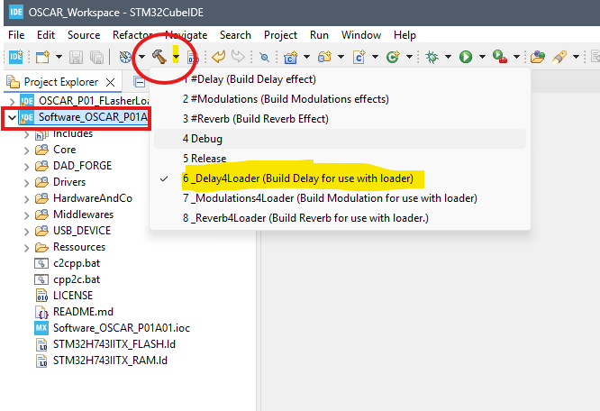
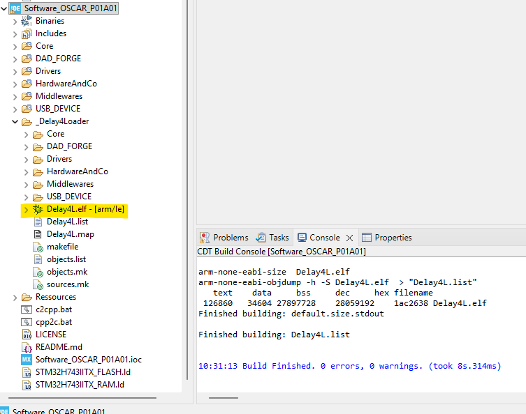

{: .text-blue-100 }
# **How to Compile Effects**

{: .text-blue-300 }
This tutorial explains how to compile effects and load them onto the OSCAR hardware platform.

{: .text-blue-200 }
## Prerequisites

**You must also have:**

* Git and STM32CubeIDE installed

* The [Software_OSCAR_P01A01](https://github.com/DADDesign-Projects/Software_OSCAR_P01A01) repository cloned and the workspace configured in STM32CubeIDE

*See: [How to Create Your Workspace](./Workspace/TutoWorkspace.md)*

***

{: .text-blue-200 }
## Compiling Effects

* Open STM32CubeIDE and select the `OSCAR_Workspace` workspace.

We will now compile the Delay effect in a version compatible with the Loader.

* Select the `Software_OSCAR_P01_A01` project.

* In the toolbar, click the small downward arrow located to the right of the hammer icon.\
  -> The list of build configurations will open.

* Click on `_Delay4Loader` in the list.

*The Delay effect will now be compiled.*

- If everything completed successfully, a `_Delay4Loader` directory should appear inside your project.\
- It contains the generated executable file `Delay.elf`

---

Compile the other effects in the same way using the following build configurations:

* `_Modulations4Loader`
* `_Reverb4Loader`

> **Tip: Build Configurations**
>
> - Build configurations starting with **#xxx** (for example `#Delay`) produce standalone executables that are stored in the internal flash memory of the STM32H743.
>
> - Build configurations ending with **4Loader** (for example `Delay4Loader`) are used to produce executables stored in the board's QSPI flash memory and launched by the bootloader.
>
> - The **Debug** configuration is used to debug the software inside the STM32CubeIDE environment.
>
> - The **Release** configuration produces a standalone executable (similar to the `#xxx` configurations). The compiled effect is determined by the contents of the following file:  
> `Software_OSCAR_P01A01/DAD_FORGE/Effects/@Config/EffectsConfig.h`