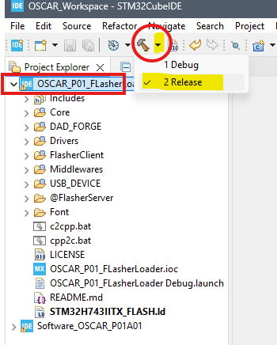
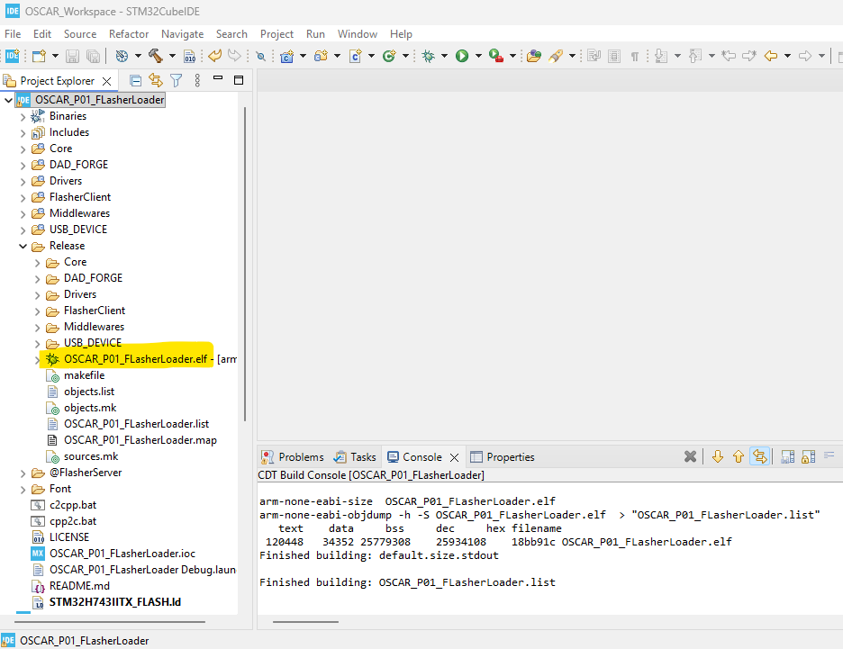

{: .text-blue-100 }
# **How to Compile FlasherLoader**

{: .text-blue-300 }
This tutorial explains how to compile FlasherLoader.

> {: tip }
> About FlasherLoader\
> - The flasher utility used to transfer resource files (images, fonts, ELF executables, samples, etc.) into the external QSPI flash memory of the OSCAR P01 board
> - The bootloader used by the pedal to launch the selected executable from the external QSPI flash memory at power-up

{: .text-blue-200 }
## Prerequisites

**You must also have:**

* Git and STM32CubeIDE installed

* The [OSCAR_P01_FlasherLoader](https://github.com/DADDesign-Projects/OSCAR_P01_FlasherLoader) repository cloned and the workspace configured in STM32CubeIDE

*See: [Workspace Tutorial](./Workspace/TutoWorkspace.md)*

***

{: .text-blue-200 }
## Compiling FlasherLoader

We will now compile FlasherLoader.

* Select the `OSCAR_P01_FlasherLoader` project.

* Build the `Release` configuration.

*FlasherLoader will now be compiled.*

* If everything completed successfully, a `Release` directory should appear inside your project.

* It contains the generated executable file `OSCAR_P01_FlasherLoader.elf`

***

