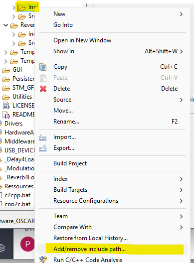
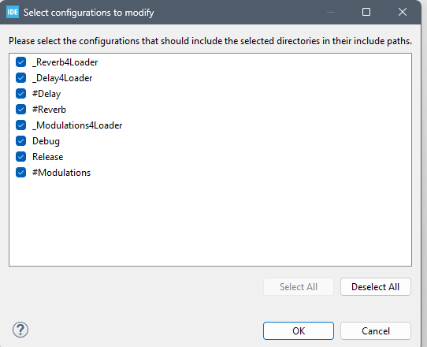
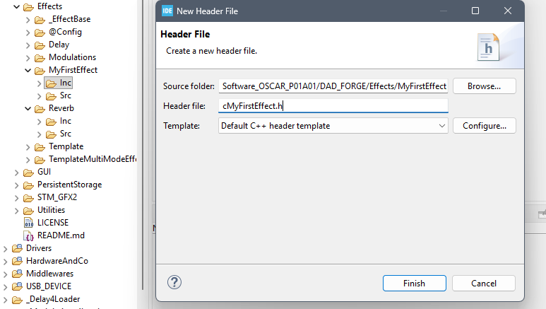

# Setting Up the Project

{: .text-blue-300 }
> First, we will set up our effect inside the project.
> * Creating the effect directories.
> * Adding our effect to the FORGE effects list.

## Creating the Effect Directories.

1. Open **STM32CubeIDE** with `OSCAR_Workspace` as your workspace.

2. Select the project `Software_OSCAR_P01A01`.

3. Create a directory named `MyFirstEffect` inside `Software_OSCAR_P01A01\DAD_FORGE\Effects`:
   - Right-click on the `Effects` folder → **New / Folder**.


4. Inside `MyFirstEffect`, create two subdirectories: `Inc` and `Src`.
   
5. Select the `Inc` directory and add it to the include path:
   - Right-click on `Inc` → **Add/Remove Include Path**, then check all build configurations.



6. Create a new header file `cMyFirstEffect.h` inside `Inc`:
   - Right-click on `Inc` → **New / Header File**.


7. Create a new source file `cMyFirstEffect.cpp` inside `Src`:
   - Right-click on `Src` → **New / Source File**.

---

# Adding Our Effect to the FORGE Effects List

Open the following file: `Software_OSCAR_P01A01\DAD_FORGE\Effects\@Config\EffectsConfig.h`

Modify the "EFFECT CONFIGURATION" section by commenting out the line `#define TEMPLATE_EFFECT` and adding the following line `#define MY_FIRST_EFFECT`

This tells FORGE to compile our effect.

```cpp
// ======================= EFFECT CONFIGURATION ===========================
#ifdef DEBUG_RELEASE_EFFECT
//#define DELAY_EFFECT
//#define MODULATIONS_EFFECT
//#define REVERB_EFFECT
//#define TEMPLATE_EFFECT
//#define TEMPLATE_MULTI_MODE_EFFECT
#define MY_FIRST_EFFECT
#endif
```

At the end of the file, add the following code to provide FORGE with the information required to run the effect:

```cpp
// Configuring the First effect
#ifdef MY_FIRST_EFFECT
#include "cMyFirstEffect.h"
#define DECLARE_EFFECT cMyFirstEffect  __Effect
#define EFFECT_NAME "My First Effect"
#define EFFECT_VERSION "Version 1.0"
#define EFFECT_SPLATCH_SCREEN "Template.png"
constexpr uint32_t EFFECT_BUILD = BUILD_ID('F', 'R', 'I', '1');
#endif
```