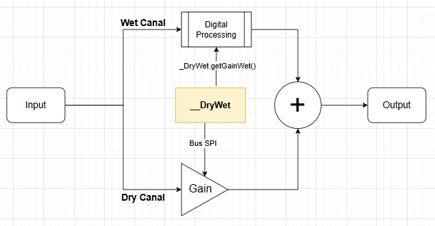

# How to mix Dry/Wet

{: .text-blue-300 }
>This chapter details the Dry/Wet principles as implemented within the OSCAR ecosystem and demonstrates how to practically achieve a Dry/Wet mix.

## The Foundation of Dry/Wet Signal Processing in OSCAR
The construction of any sound effect relies on the synergistic blending between the untreated source signal (**Dry**) and the effect-modified signal (**Wet**).  

Within the OSCAR architecture, this processing is entirely realized in analog to achieve optimal sonic quality. The Dry channel remains purely analog; it does not pass through the complete digital processing loop (Analog-to-Digital conversion (A/D), DSP processing, and Digital-to-Analog reconversion (D/A)).  

This principle guarantees not only **zero latency** for the dry signal, but also ensures **perfect sonic integrity**.

## L'objet __DryWet
The gain of the dry channel (the untreated original signal) is adjusted using an electronic potentiometer.  
To simplify usage, this technical aspect is entirely managed by the global object `__DryWet`. This object controls the digital potentiometer and automatically calculates the wet gain in a transparent manner, hiding all the complexity involved in maintaining a consistent psychoacoustic level between the dry and wet signals..



## Le code 

We are going to change the behavior of the `m_DelayMix` parameter.  
First, we add a callback to intercept any changes to this parameter.  
**In cMyFirstEffect.h**  
Add the callback declaration:  

```cpp
    // -------------------------------------------------------------------------
    // Mix callback
    // -------------------------------------------------------------------------
    void static onMixChange(DadDSP::cParameter* pMixParameter, uint32_t Data);
```

**In cMyFirstEffect.cpp**  
In the `onInitialize()` methode, update the initialization of the `m_DelayMix` parameter to include the callback:  

```cpp
    // Initialize the Mix parameter
    m_DelayMix.Init(MY_FIRST_EFFECT_ID,     // Serialize ID
                         50.0f,             // Default value
                         0.0f,              // Minimum value
                         100.0f,            // Maximum value
                         10.0f,             // Fast increment 150ms
                         1.0f,              // Slow increment 50ms
                         onMixChange,       // Callback function
                         (uint32_t)this,    // Callback user data
                         1.0f,              // Transition time (seconds)
                         25);               // MIDI CC number
```

At the end of the file, implement the callback. It updates the Dry/Wet mix ratio using the global `__DryWet` object:   

```cpp
// -------------------------------------------------------------------------
// Mix callback
// -------------------------------------------------------------------------
void cMyFirstEffect::onMixChange(DadDSP::cParameter* pMixParameter, uint32_t Data){
    __DryWet.setMix(pMixParameter->getValue());
}
```
In the `onProcess()` function, replace the previous mixing code with the following:
We ask the `__DryWet` object for the gain to apply to the Wet channel.  
The Dry channel is no longer processed manually, __DryWet now fully handles the mixing.

> The factor 1.25f compensates for the gain reduction introduced by the feedback loop.
> The feedback is calculated as: m_DelayFeedback.getValue() * 0.008f,
> which represents an attenuation to 0.8% of full scale.
> To maintain consistent overall loudness and prevent a noticeable loss of level
> on the Wet signal, we apply a compensatory gain of 1.25 (equivalent to +1.94 dB)

```cpp
// Mix Dry/Wet and apply gain to both channels
float GainWet = __DryWet.getGainWet();
pOut->Left  = DelayLeftOut * GainWet  * m_LeftGain * 1.25f;
pOut->Right = DelayRightOut * GainWet * m_RightGain * 1.25f;
```
## Final Code

### **cMyFirstEffect.h**

```cpp
#pragma once
#include "cEffectBase.h"
#include "cDelayLine.h"

class cMyFirstEffect : public DadEffect::cEffectBase {
public:
    // -------------------------------------------------------------------------
    // Constructor - performs no initialization by itself
    // -------------------------------------------------------------------------
    cMyFirstEffect() = default;

    // -------------------------------------------------------------------------
    // Initializes DSP components and user interface parameters
    // -------------------------------------------------------------------------
    void onInitialize() override;

    // -------------------------------------------------------------------------
    // Returns the unique effect identifier
    // -------------------------------------------------------------------------
    uint32_t getEffectID() override;

    // -------------------------------------------------------------------------
    // Audio processing function - processes one input/output audio buffer
    // -------------------------------------------------------------------------
    void onProcess(AudioBuffer *pIn, AudioBuffer *pOut, eOnOff OnOff, bool Silence) override;

    // -------------------------------------------------------------------------
    // Gain callback
    // -------------------------------------------------------------------------
    void static onGainChange(DadDSP::cParameter* pGainParameter, uint32_t Data);

    // -------------------------------------------------------------------------
    // Pan callback
    // -------------------------------------------------------------------------
    void static onPanChange(DadDSP::cParameter* pBalanceParameter, uint32_t Data);

    // -------------------------------------------------------------------------
    // Mix callback
    // -------------------------------------------------------------------------
    void static onMixChange(DadDSP::cParameter* pMixParameter, uint32_t Data);

    // -------------------------------------------------------------------------
    // Compute left/right channel gains using a logarithmic (power) curve
    // -------------------------------------------------------------------------
     void CalcGainLog();

protected:
    // =========================================================================
    // Protected Member Variables
    // =========================================================================

    // -------------------------------------------------------------------------
    // Parameter declarations
    // -------------------------------------------------------------------------
    DadGUI::cUIParameter                m_ParameterGain;        // Gain control parameter
    DadGUI::cUIParameter                m_ParameterPan;         // Stereo Panning parameter
    DadGUI::cUIParameter                m_ParameterStereoMode;  // Stereo mode parameter
    DadGUI::cUIParameter                m_DelayTime;            // Time parameter
    DadGUI::cUIParameter                m_DelayFeedback;        // Feedback parameter
    DadGUI::cUIParameter                m_DelayMix;             // Mix parameter

    // -------------------------------------------------------------------------
    // Parameter view declarations
    // -------------------------------------------------------------------------
    DadGUI::cParameterNumNormalView     m_ParameterGainView;    	// GUI view for the gain parameter
    DadGUI::cParameterNumLeftRightView  m_ParameterPanView;  		// GUI view for Panning parameter
    DadGUI::cParameterDiscretView       m_ParameterStereoModeView;	// GUI view for stereo mode parameter
    DadGUI::cParameterNumNormalView     m_DelayTimeView;               // GUI view for Time parameter
    DadGUI::cParameterNumNormalView     m_DelayFeedbackView;           // GUI view for Feedback parameter
    DadGUI::cParameterNumNormalView     m_DelayMixView;                // GUI view for Mix parameter

    // -------------------------------------------------------------------------
    // Panel declarations
    // -------------------------------------------------------------------------
    DadGUI::cPanelOfParameterView       m_DelayPanel;                 // Delay panel
    DadGUI::cPanelOfParameterView       m_ParameterFirstPanel;        // Demo panel containing parameter views


    // -------------------------------------------------------------------------
    // Delay lines
    // -------------------------------------------------------------------------
    DadDSP::cDelayLine                m_LeftDelayLine;          // Left delay line
    DadDSP::cDelayLine                m_RightDelayLine;         // Right delay line

    // -------------------------------------------------------------------------
    // Variables
    // -------------------------------------------------------------------------
    float   m_RightGain;  // Right gain calculated
    float   m_LeftGain;   // Left gain calculated
};


```

### **cMyFirstEffect.cpp**
```cpp
#include "EffectsConfig.h"

#ifdef MY_FIRST_EFFECT
#include "cMyFirstEffect.h"

// Unique effect identifier (32-bit)
constexpr uint32_t MY_FIRST_EFFECT_ID = BUILD_ID('M', 'F', 'E', '1');

// Delay
constexpr float DELAY_MAX_TIME = 2.0f;  // Maximum delay time in seconds
constexpr float DELAY_MIN_TIME = 0.1f;  // Minimum delay time in seconds

// Calculate buffer size based on sampling rate and max delay time
constexpr uint32_t DELAY_BUFFER_SIZE = static_cast<uint32_t>((SAMPLING_RATE * DELAY_MAX_TIME) + 0.999f);

// Allocate delay buffers in SDRAM (extra 100 samples for interpolation safety)
SDRAM_SECTION float __DelayBufferLeft[DELAY_BUFFER_SIZE + 100];   // Left channel delay buffer
SDRAM_SECTION float __DelayBufferRight[DELAY_BUFFER_SIZE + 100];  // Right channel delay buffer

// -----------------------------------------------------------------------------
// Method: onInitialize
// Description: Called once when the effect is loaded. Used to initialize
//              parameters, GUI elements, and internal DSP objects.
// -----------------------------------------------------------------------------
void cMyFirstEffect::onInitialize()
{
    // Initialize the Gain parameter
    m_ParameterGain.Init(MY_FIRST_EFFECT_ID,// Serialize ID
                         100.0f,            // Default value
                         0.0f,              // Minimum value
                         100.0f,            // Maximum value
                         5.0f,              // Fast increment
                         1.0f,              // Slow increment
                         onGainChange,      // Callback function
                         (uint32_t)this,    // Callback user data
                         1.0f,              // Transition time (seconds)
                         20);               // MIDI CC number

    // Initialize the Gain parameter
    m_ParameterPan.Init(MY_FIRST_EFFECT_ID, // Serialize ID
                         0.0f,              // Default value
                         -100.0f,           // Minimum value
                         100.0f,            // Maximum value
                         5.0f,              // Fast increment
                         1.0f,              // Slow increment
                         onPanChange,       // Callback function
                         (uint32_t)this,    // Callback user data
                         1.0f,              // Transition time (seconds)
                         21);               // MIDI CC number

    // Initialize the Gain parameter
    m_ParameterStereoMode.Init(MY_FIRST_EFFECT_ID,// Serialize ID
                         0.0f,              // Default value
                         0.0f,              // Minimum value
                         0.0f,              // Maximum value
                         1.0f,              // Fast increment
                         1.0f,              // Slow increment
                         nullptr,           // Callback function
                         0,                 // Callback user data
                         0.0f,              // Transition time (seconds)
                         22);               // MIDI CC number

    // Initialize the Time parameter
    m_DelayTime.Init(MY_FIRST_EFFECT_ID,    // Serialize ID
                         0.35f,             // Default value 350ms
                         DELAY_MIN_TIME,    // Minimum value 100ms
                         DELAY_MAX_TIME,    // Maximum value 2 s
                         0.15f,             // Fast increment 150ms
                         0.05f,             // Slow increment 50ms
                         nullptr,           // Callback function
                         0,                 // Callback user data
                         2.0f,              // Transition time (seconds)
                         23);               // MIDI CC number

    // Initialize the Feedback parameter
    m_DelayFeedback.Init(MY_FIRST_EFFECT_ID,// Serialize ID
                         35.0f,             // Default value
                         0.0f,              // Minimum value
                         100.0f,            // Maximum value
                         10.0f,             // Fast increment 150ms
                         1.0f,              // Slow increment 50ms
                         nullptr,           // Callback function
                         0,                 // Callback user data
                         1.0f,              // Transition time (seconds)
                         24);               // MIDI CC number

    // Initialize the Mix parameter
    m_DelayMix.Init(MY_FIRST_EFFECT_ID,     // Serialize ID
                         50.0f,             // Default value
                         0.0f,              // Minimum value
                         100.0f,            // Maximum value
                         10.0f,             // Fast increment 150ms
                         1.0f,              // Slow increment 50ms
                         onMixChange,       // Callback function
                         (uint32_t)this,    // Callback user data
                         1.0f,              // Transition time (seconds)
                         25);               // MIDI CC number

    // Initialize the GUI view for the parameter
    m_ParameterGainView.Init(&m_ParameterGain,// Linked parameter
                             "Gain",        // Short name
                             "Gain",        // Long name
                             "%",           // Unit (short)
                             "percent");    // Unit (long)

    // Initialize the GUI view for the parameter
    m_ParameterPanView.Init(&m_ParameterPan,// Linked parameter
                             "Pan",         // Short name
                             "Pan control", // Long name
                             "%",           // Unit (short)
                             "percent");    // Unit (long)

    // Initialize the GUI view for the parameter
    m_ParameterStereoModeView.Init(&m_ParameterStereoMode, // Linked parameter
                             "Mode",        // Short name
                             "Stereo Mode");// Long name

    m_ParameterStereoModeView.AddDiscreteValue(
                            "Stereo",       // ShortDiscretValue
                            "Stereo");      // LongDiscretValue

    m_ParameterStereoModeView.AddDiscreteValue(
                            "Mono",         // ShortDiscretValue
                            "Mono");        // LongDiscretValue

    // Initialize the GUI view for the parameter
    m_DelayTimeView.Init(& m_DelayTime,     // Linked parameter
                             "Time",        // Short name
                             "Time",        // Long name
                             "s",           // Unit (short)
                             "second");     // Unit (long)

    // Initialize the GUI view for the parameter
    m_DelayFeedbackView.Init(&m_DelayFeedback,  // Linked parameter
                             "Feed.",       // Short name
                             "Feedback",    // Long name
                             "%",           // Unit (short)
                             "percent");    // Unit (long)

    // Initialize the GUI view for the parameter
    m_DelayMixView.Init(&m_DelayMix,        // Linked parameter
                             "Mix",         // Short name
                             "Mix",         // Long name
                             "%",           // Unit (short)
                             "percent");    // Unit (long)

    // Create a parameter panel for the user interface
    m_ParameterFirstPanel.Init(&m_ParameterGainView,      // Parameter View 1
                              &m_ParameterPanView,        // Parameter View 2
                              &m_ParameterStereoModeView);// Parameter View 3

    m_DelayPanel.Init(    &m_DelayTimeView,             // Parameter View 1
                          &m_DelayFeedbackView,         // Parameter View 2
                          &m_DelayMixView);             // Parameter View 3

    // Add the panel to the effect's menu
    m_Menu.addMenuItem(&m_DelayPanel, "Delay");
    m_Menu.addMenuItem(&m_ParameterFirstPanel, "First");

    // Delay lines initialization
    m_LeftDelayLine.Initialize(__DelayBufferLeft, DELAY_BUFFER_SIZE);
    m_RightDelayLine.Initialize(__DelayBufferRight, DELAY_BUFFER_SIZE);
}

// -----------------------------------------------------------------------------
// Method: getEffectID
// Description: Returns the unique 32-bit identifier of the effect.
// -----------------------------------------------------------------------------
uint32_t cMyFirstEffect::getEffectID()
{
    return MY_FIRST_EFFECT_ID;
}

// -----------------------------------------------------------------------------
// Method: onProcess
// Description: Main audio processing function. Called continuously for
//              every audio buffer.
// -----------------------------------------------------------------------------
void cMyFirstEffect::onProcess(AudioBuffer *pIn, AudioBuffer *pOut, eOnOff OnOff, bool Silence)
{
    float Left = pIn->Left;
    float Right = pIn->Right;

    // Test stereo mode
    if(m_ParameterStereoMode.getValue() == 1.0f){
    	// convert to mono
    	Left = (Left + Right) / 2.0f;
    	Right = (Right + Left) / 2.0f;
    }

    // Convert delay time to samples
    float DelaySample = m_DelayTime * SAMPLING_RATE;

    // Reading the delayed line with a DelaySample delay
    float DelayLeftOut = m_LeftDelayLine.Pull(DelaySample);
    float DelayRightOut = m_RightDelayLine.Pull(DelaySample);

    // Recording of the input sample and feedback in the delay line
    float FeedBack = m_DelayFeedback.getValue() * 0.008f;
    if (OnOff == eOnOff::On) {
        // Mode On
    	m_RightDelayLine.Push((Right + DelayRightOut) * FeedBack);
        m_LeftDelayLine.Push((Left + DelayLeftOut) * FeedBack);
    }else{
        // Mode Off
        m_RightDelayLine.Push(DelayRightOut * FeedBack);
        m_LeftDelayLine.Push(DelayLeftOut * FeedBack);
    }

    // Mix Dry/Wet and apply gain to both channels
    float GainWet = __DryWet.getGainWet();
    pOut->Left  = DelayLeftOut * GainWet * m_LeftGain * 1.25f;
    pOut->Right = DelayRightOut * GainWet * m_RightGain * 1.25f;
}

// -------------------------------------------------------------------------
// Compute left/right channel gains using a logarithmic (power) curve
// -------------------------------------------------------------------------
void cMyFirstEffect::CalcGainLog()
{
    // Retrieve normalized parameter values [0.0 .. 1.0]
    float Gain    = m_ParameterGain.getNormalizedValue();
    float Pan = m_ParameterPan.getNormalizedValue();

    // Constant-power panning law: apply a square-root curve (exponent 0.5)
    float gain_left  = std::pow(1.0f - Pan, 0.5f); // fades out as pan moves right
    float gain_right = std::pow(Pan,         0.5f); // fades in  as pan moves right

    // Apply the master gain on top of each channel's pan gain
    m_LeftGain  = Gain * gain_left;
    m_RightGain = Gain * gain_right;
}

// -------------------------------------------------------------------------
// Gain callback
// -------------------------------------------------------------------------
void cMyFirstEffect::onGainChange(DadDSP::cParameter* pGainParameter, uint32_t Data){

	// Cast Data to cMyFirstEffect instance pointer
	cMyFirstEffect* pThis = (cMyFirstEffect *) Data;

	pThis->CalcGainLog();
}

// -------------------------------------------------------------------------
// Pan callback
// -------------------------------------------------------------------------
void cMyFirstEffect::onPanChange(DadDSP::cParameter* pPanParameter, uint32_t Data){
	cMyFirstEffect* pThis = (cMyFirstEffect *) Data;

	pThis->CalcGainLog();
}

// -------------------------------------------------------------------------
// Mix callback
// -------------------------------------------------------------------------
void cMyFirstEffect::onMixChange(DadDSP::cParameter* pMixParameter, uint32_t Data){
	__DryWet.setMix(pMixParameter->getValue());
}
#endif

```
