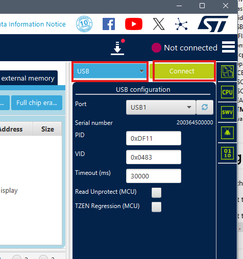
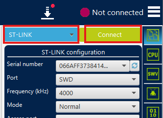
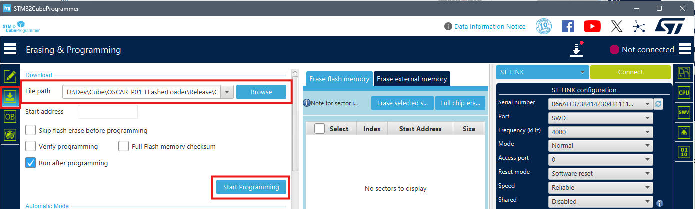

# How to Program OSCAR

{: .text-blue-300 }
This tutorial explains how to program the FlasherLoader or an audio effect onto the OSCAR hardware platform.

## Prerequisites

**You must have the following:**

*   STM32CubeProgrammer installed.
*   A working OSCAR pedal (hardware platform) with a compatible 12V power supply, required for downloading and running the software.
*   The software to be loaded already compiled:
    *   See tutorials: [How to Compile Effects](./Workspace/BuildEffects.md) and [How to Compile FlasherLoader](./Workspace/BuildFlasher.md).
    *   For effects: Use build configurations `Release`, `#Delay`, `#Reverb`, or `#Modulations`.
    *   For FlasherLoader: Use the `Release` build configuration.
*   Optionally, an ST-Link programmer.

***

## Programming OSCAR

To program the software into the STM32H743 internal memory, you can use one of two methods:

1.  An ST-Link programmer.
2.  The USB DFU protocol.

### Programming Using DFU Mode (Without ST-Link)

Follow these steps to utilize DFU mode:

*   Connect the OSCAR pedal to your computer using a USB cable.
*   Power on OSCAR while keeping the **BOOT** button pressed. (*This action puts the board into DFU mode.*)
*   Launch STM32CubeProgrammer.
*   In STM32CubeProgrammer:
    *   Select `USB`.
    *   Click `Connect`.

### Programming Using an ST-Link

If you are using an ST-Link programmer, follow these steps:

*   Before powering the board, connect your ST-Link to OSCAR using the 4-pin debug connector with the following mapping:
    *   GND -> 0V
    *   SWDIO -> DIO
    *   SWCLK -> CLK
*   Power on OSCAR.
*   Launch STM32CubeProgrammer.
*   In STM32CubeProgrammer:
    *   Select `ST-LINK`.
    *   Click `Connect`.

### Final Programming Steps (DFU or ST-Link)

Once connected via either DFU or ST-Link, perform the final programming steps:

1.  Select the **`Erasing & Programming`** tab in STM32CubeProgrammer.
2.  Select the ELF file you wish to program (e.g., FlasherLoader):
    `......\OSCAR_Workspace\OSCAR_P01_FlasherLoader\Release\OSCAR_P01_FlasherLoader.elf`
3.  Click **`Start Programming`**.

