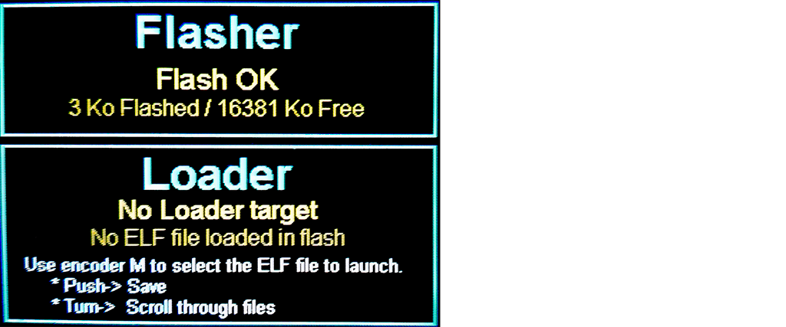

# How to Use FlasherLoader

{: .text-blue-300 }
This tutorial explains the purpose of the `FlasherLoader` utility and how to use it with the OSCAR ecosystem.

## Why FlasherLoader Exists

OSCAR executable programs use resource files such as fonts, images, samples, and other assets.  
Without these resources, the effects cannot operate correctly.

Before running any effect, all required resources must therefore be loaded into the external QSPI flash memory of the OSCAR platform.

---

## The FlasherLoader

`FlasherLoader` has two main functions:

* **Flasher**  
  In collaboration with `OSCAR_Flasher_Server`, the FlasherLoader receives files through the USB connection and stores them into the OSCAR platform QSPI flash memory.

* **Loader**  
  When the OSCAR platform powers on, the FlasherLoader loads an executable ELF file into RAM and starts its execution.

---

## The Flasher Server

`OSCAR_Flasher_Server` is a utility program that runs on your computer.

It allows you to transfer files through a COM port over the USB connection linked to the OSCAR pedal.


{: .warning}
> **Note:**  
> The Flasher Server currently only works on Windows.  
> Contributions are welcome to help port the utility to Linux or macOS.  
> A Python implementation could also be a good alternative.

---

## Preparation of files by the server processor

The Flasher Server preprocesses some file types to simplify their use inside OSCAR effects:**

**Image Files**
Supported formats:

* JPG
* PNG
* GIF
* and more...

Image files are automatically converted to RAW format and become directly compatible with the `DAD_FORGE / STM_GFX` graphics library.

**ELF Effect Files (Executables)**
ELF executables are:

* Parsed
* Processed
* Reformatted for easy use by the OSCAR Loader

**Other Files**

All other file types are transferred without modification.


---

## Prerequisites

You must have:

* A working OSCAR pedal with a compatible 12V power supply
* `FlasherLoader` already programmed into the STM32 internal flash memory

See tutorials:

* `How to Compile FlasherLoader`
* `How to Program OSCAR`

---

## Using FlasherLoader

### Start the Flasher Server

On your computer, launch:

```text
...\OSCAR_Workspace\OSCAR_P01_FlasherLoader\@FlasherServer\OSCAR_Flasher_Server.exe
```

Connect the OSCAR pedal to your computer using a USB cable.

Power on the pedal while holding **Footswitch 1** pressed.

This disables automatic booting and displays the FlasherLoader interface.

---

## OSCAR FlasherLoader Interface
The interface contains two sections:


### Top Section: Flasher

Displays the current flashing status and transfer progress.

### Bottom Section: Loader

Displays:

* The executable files currently stored in QSPI flash memory
* The executable selected to start automatically at power-up

---

## Detecting the OSCAR Pedal

In `OSCAR_Flasher_Server`:

1. Click **Refresh**
2. A new COM port should appear
3. Select the new COM port

The information window should display:

```text
OK : OSCAR is detected on COMxx
```

---

## Adding Resource Files

OSCAR effects require at minimum all resource files located in:

```text
...\OSCAR_Workspace\Software_OSCAR_P01A01\Ressources
```

### Add Binary Resources

1. Click **Add File**
2. Open:

```text
...\OSCAR_Workspace\Software_OSCAR_P01A01\Ressources\bin
```

3. Select all files
4. Click **Open**

The files appear in the flashing list.

### Add Image Resources

1. Click **Add File**
2. Open:

```text
...\OSCAR_Workspace\Software_OSCAR_P01A01\Ressources\Images
```

3. Select all files
4. Click **Open**

The files appear in the flashing list.

---

## Adding Effect Executables

Before continuing, the effects must be compiled using the following build configurations:

* `_Delay4Loader`
* `_Reverb4Loader`
* `_Modulations4Loader`

See tutorial: [How to Compile Effects](./How to Compile Effects/How to Compile Effects.md)

Add the executable files:

### Delay

```text
....\OSCAR_Workspace\Software_OSCAR_P01A01\_Delay4Loader\Delay4L.elf
```

### Reverb

```text
....\OSCAR_Workspace\Software_OSCAR_P01A01\_Reverb4Loader\Reverb4L.elf
```

### Modulations

```text
....\OSCAR_Workspace\Software_OSCAR_P01A01\_Modulations4Loader\Modulations4L.elf
```

---

## Flashing the Files

Click the **Flash** button to start the transfer.

On the OSCAR pedal:

1. All existing files in QSPI flash memory are erased
2. File transfer and storage begin
3. Progress is synchronized with the Flasher Server
4. Used and remaining flash memory sizes are displayed in real time

Once all files are written:

* The FlasherLoader verifies the data
* The screen displays:

```text
Flash OK
```

---

## OFSF Files

You can save an entire file list into a single `.ofsf` file by clicking **Save Files**.

Later, you can simply add this OFSF file to the flashing list instead of manually selecting all files again.

Advantages:

* Faster workflow
* Fewer manipulation errors
* Easy project archiving
* Easy deployment of complete standalone configurations

---

## Selecting the Executable to Launch

On the OSCAR pedal:

* Rotate encoder **M** to browse executable files stored in QSPI flash
* Press the encoder **M** to select the executable that will launch automatically at power-up

---

## Launching an Effect

Power cycle the pedal or press the **RESET** button.

The selected effect should start automatically.

---

## Returning to FlasherLoader Mode

If you want to:

* Change the executable to launch
* Transfer new files

You must hold **Footswitch 1** during power-up.

The executable launch is cancelled and the FlasherLoader interface appears again.

---

## 🎉Congratulations

You have successfully programmed your OSCAR pedal with its effects.

🎸 Now it is time to make music :)

Naturally, you will probably want to:

* Modify existing effects
* Create completely new ones

The OSCAR ecosystem and the DAD_FORGE library were designed to simplify development by handling hardware complexity and providing many helpers:

* Graphics (GFX)
* GUI tools
* DSP helpers
* Resource management
* Hardware abstraction

{: .note}
>🎶 This allows you to focus on what matters most:  
>**Designing and creating the digital audio effects you have always dreamed of**.