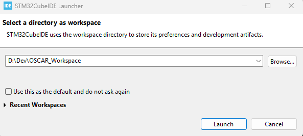
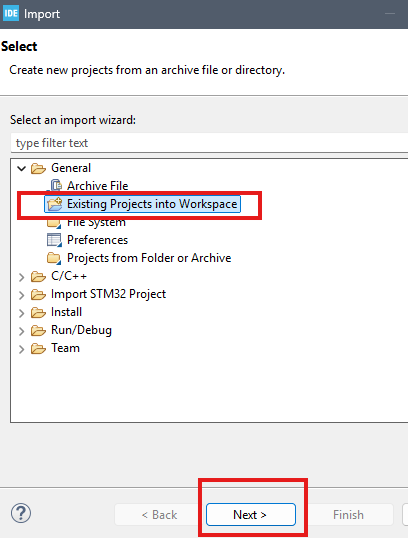
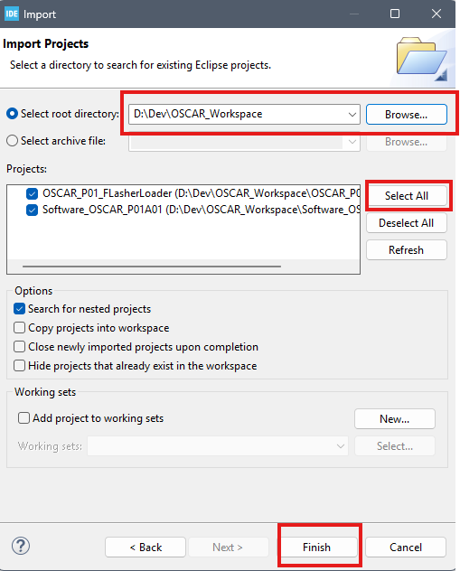
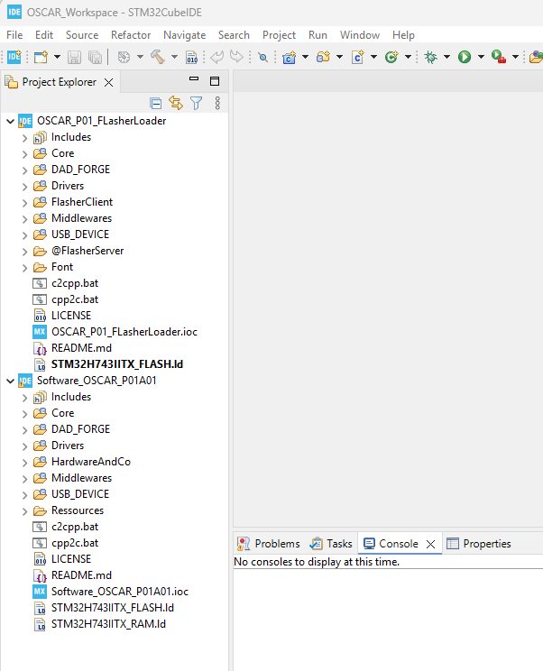

{: .text-blue-100 }
# **How to Create Your Workspace**

{: .text-blue-300 }
This tutorial explains how to clone and set up the repositories required to develop audio effects with the OSCAR Workshop environment.

> {: .note }
> **Note**  
> Once you are familiar with the OSCAR Workshop environment and the development tools, you can of course organize your workspace and repositories differently.\
> The method described here is simply a recommended starting point.

## Prerequisites

Before starting, make sure the following tools are installed on your computer:

* Git

* STMicroelectronics STM32CubeIDE

***

## Creating the Workspace Directory

Create a working directory for STM32CubeIDE projects, for example, here: **`OSCAR_Workspace`**

Create:

```bash
mkdir OSCAR_Workspace
```

Change to the newly created directory:

```bash
cd OSCAR_Workspace
```

***

## Cloning the OSCAR Effect Development Framework

Clone the repository 'Software_OSCAR_P01A01' containing the OSCAR P01A01 Software effect development framework:

```bash
git clone --recurse-submodules https://github.com/DADDesign-Projects/Software_OSCAR_P01A01
```

This repository contains the framework and examples used to develop audio effects for the OSCAR P01A01 hardware platform.

***

## Cloning the OSCAR Flasher Loader

Clone the OSCAR flasher/bootloader project:

```bash
git clone --recurse-submodules https://github.com/DADDesign-Projects/OSCAR_P01_FLasherLoader
```

This project contains:

* The flasher utility used to transfer resource files (images, fonts, ELF executables, samples, etc.) into the external QSPI flash memory of the OSCAR P01 board

* The bootloader used by the pedal to launch the selected executable from the external QSPI flash memory at power-up

***

## Opening the Workspace in STM32CubeIDE

* Launch STM32CubeIDE.\
  When prompted for the workspace location:

  * Click on **Browse**

  * Select the directory you just created (`OSCAR_Workspace` in this tutorial)



***

## Import Project in STM32CubeIDE Workspace

### 1. In the **Project Explorer**, click on **Import Projects**.


### 2. In the **Import** dialog box

* select **General** /**Existing Projects into Workspace**,

* then click the **Next** button.



### 3. In the **Import** dialog box, select the **root directory**:

* Click on **Browse** 🔍

* Select your workspace directory (`OSCAR_Workspace` in this example)

* Click on **Select All** ✅

* Click on the **Finish** button




***

## ✅ Your Workspace is now configured

You're ready to start working with OSCAR projects.  
👉 See the next tutorial to compile your first effect  


